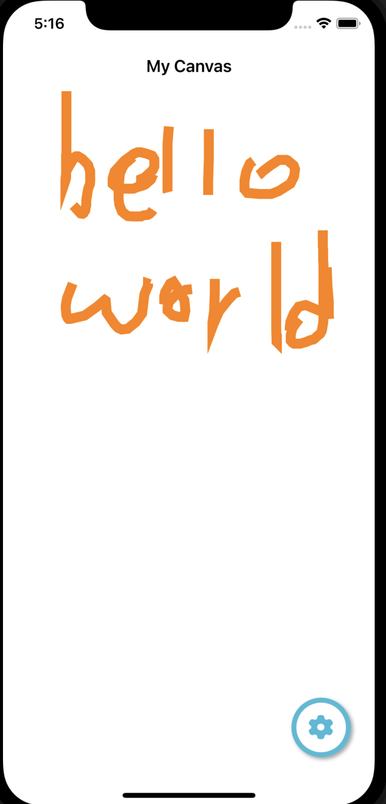
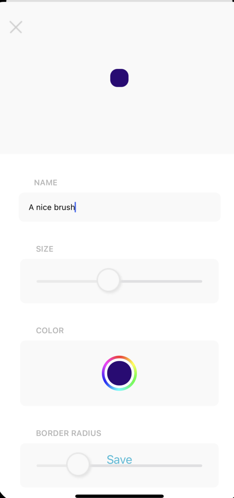
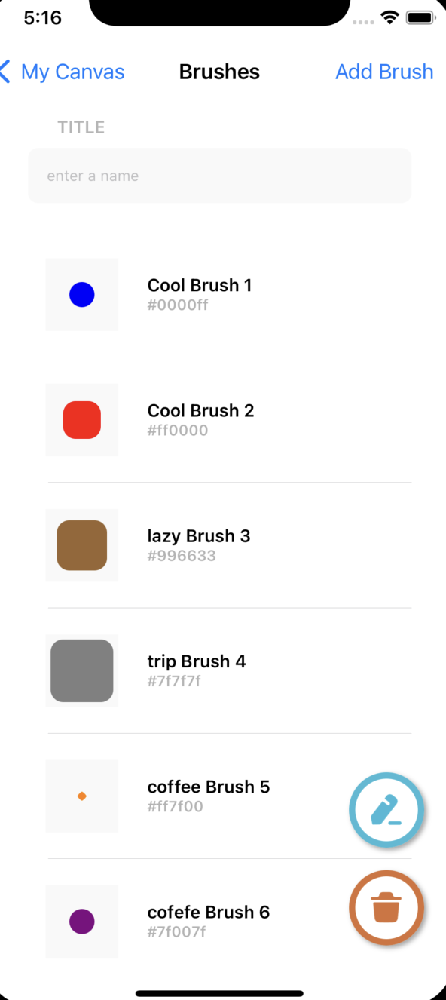

# Canvas
A drawing app that lets you draw using your own brushes.

**Preview**

<table>
<tr>
<td width="25%">

Drawing

</td>
<td width="25%">

Pre-made Brushes

</td>
<td width="25%">

Creating a brush

</td>
</tr>
<tr>
<td width="25%">
</img>
</td>
<td width="25%">
</img>
</td>
<td width="25%">
</img>
</tr>
</table>

## 🌟 Features

- [x] Drawing 
- [x] Selecting a brush
- [x] creating a brush

**Bugs/fixes**
There are still some things that I would want to fix.
1. making the brush smoother 
2. Support for different brushes and colors 

